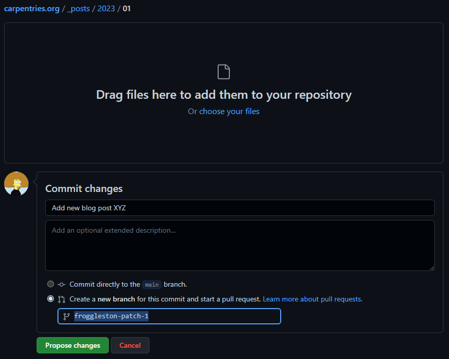

## Collaborative Blog Post Writing

The Carpentries welcomes blog posts from our community members including workshop host sites, instructors, learners, and more. Are you interested in publishing a post on The Carpentries blog?

### Sharing blog post ideas

- Join The Carpentries Slack and share your blog post idea in the #blog-post-ideas channel to start discussion and invite other community members to collaborate with you (<mark>preferred</mark>)

- Email community[at]carpentries[dot]org with your idea and one of the team will facilitate amplification of the idea in the community so others can reach out and collaborate with you (<mark>option</mark>)


### Sharing ready-to-publish drafts

Our blog content is formatted in Markdown, and rendered as html thanks to Jekyll. You can submit your blog post draft in one of three ways
- Email your blog post draft to community[at]carpentries[dot]org, or
submit it through [this form](https://docs.google.com/forms/d/e/1FAIpQLSeiu5NzJsLxYueaQrNn_qKbaa5JR2Sz12CeCRyedKQxwb54Dw/viewform) and one of the team will follow up with you to get it published. (<mark>low time requirement</mark>)

If you wish to submit a blog post about your favourite tool or workflow, you can submit the post through [this form](https://docs.google.com/forms/d/e/1FAIpQLSeiu5NzJsLxYueaQrNn_qKbaa5JR2Sz12CeCRyedKQxwb54Dw/viewform) and we will post it on the blog for you.

- Create a [CodiMD](https://codimd.carpentries.org/) file, convert your post to Markdown [[see Markdown cheatsheet](https://www.markdownguide.org/cheat-sheet/)], add a YAML header to the top of your Markdown file, open an issue in The Carpentries blog GitHub repository with new post appended to the issue title. One of the team will help get it published. (<mark>moderate-time requirement</mark>)

- Convert your post to Markdown [[see Markdown cheatsheet](https://www.markdownguide.org/cheat-sheet/)], add a YAML header to the top of your Markdown file, and submit a Pull Request to The Carpentries blog GitHub repository (<mark>more tasking</mark>).

Read below and find out how to contribute a blog post to

  - [The Carpentries blog](#how-to-contribute-a-blog-post-to-the-carpentries-blog)


#### General recommendations

* For our websites, we use lower kebab case for our file names pages. So
  `example-page.md` is a valid file name but `ExamplePage.md` or `example_page`
  are not.
* Try to avoid using shorthand, acronyms, or contractions in the file names (and
  by extension in the permalinks).
* Favor using the actual numbers in the file names and permakinks instead: use
  `12` rather than `twelve`.
* When relevant, include `carpentries` in the file names and permalinks: favor
  `new-carpentries-team-member` over `new-team-member`.
* Use 3 to 6 words to compose the file names (and permalinks) and the headings
  on your page and blog posts.
* For titles:
  * Please use title case 
  * We recommend making sure the title is descriptive and uses no more than 5-7 words. 
  * When possible, use an action verb or call to action EX:"Amending the Carpentries Bylaws in 2020" or "Expanding The Carpentries Community in California"
* For headers/previews: 
  * We recommend a full sentence that succinctly describes the contents of the blog. EX: "Read on to learn about our strategic plan progress through Q3 2020 (July - September)" or "Join us in welcoming our new Maintainer Community Lead!"
  * Please avoid "in this blog post..."
  * If your title does not have a direct call to action, please include one in the header/preview text


You can include a `time:` entry in the YAML header of the blog posts. The time
is in the 24-hour format and in UTC. It is useful to think of this time as the
earliest the post will appear on the website, but it could end up being
published a few hours later. Our website is being built every 6 hours at 00:30,
06:30, 12:30, 18:30 UTC. So if you include `time: 08:00:00` in the YAML header
of your post, your post will appear after the 12:30 build completes. However, if
there is a manual update to the website at 9:00, your post will appear soon
after completion of the build triggered by this change.


#### How to Contribute a Blog Post to The Carpentries blog

1.  Create a local [Markdown](https://guides.github.com/features/mastering-markdown/) file for your blog post 
    and name it according to this convention and case (lower kebab case).

    `YYYY-MM-DD-filename.md`

    e.g.

    `2018-04-29-book-review-teaching.md`

2.  In order to render correctly, posts need to have a header block, which should be created like [this example](https://github.com/carpentries/carpentries.org/blob/gh-pages/_posts/2018/04/2018-04-25-website-launch.md), e.g.

    ```
    ---
    layout: page
    authors: ["Tracy Teal", "Belinda Weaver"]
    teaser: "New website for access to all things Carpentries"
    title: "Launching The Carpentries Website"
    date: 2018-04-25
    time: "09:00:00"
    tags: ["Website", "Communications"]
    ---
    ```

    Separate the header block from the post text by inserting a new line.

3.  All fields should be filled in. If there is more than one author, separate the author names like this: `["Name 1", "Name 2"]`.

4.  Complete your blog post and leave placeholders in the text for any images that you will add in a following step, e.g. `ADD IMAGE - Figure 1: Caption`

5.  To add your file to the github repository for blog posts,
    please go to <https://github.com/carpentries/carpentries.org>.

6.  Click on the `_posts` folder, and go to the year and month in which you wish to add your post, e.g. `2023/01`.

7.  If a folder does not exist for the month you need:

    - Click on the year, e.g. `2023`, click `Add file` then `Create new file`, and in the box that says `Name your file...`, enter in the month 
      followed by a slash, e.g. `02/`. The slash is very important to tell GitHub this is a folder.
       
    - At the bottom of the page, select `Create a new branch for this commit and start a pull request`. make a note of the name of the patch, and
      click `Propose new file`.
    
      
    
    - On the next window, click `Create pull request`.
    
    - You should now see your new PR open, with a line that reads `<you> wants to merge 1 commit into main from <new_patch_branch_name>`.
      The `<new_patch_branch_name>` will match the name given to you when you created your PR.
       
    - Click on the `<new_patch_branch_name>` link, e.g. `froggleston-patch-1`, and navigate back to the `_posts/<year>/<month>/` folder.
    
    - Click `Upload files`, drag your new blog post markdown file into the box, or click `choose your files` to open a
      file browser and select your files.
       
    - Make sure `Commit directly to the <new_patch_branch_name> branch` is selected.
    
    - Click `Commit changes`.
    
    - Go to step 9.

8.  If a folder does already exist:

    - Make sure you are in the correct `_posts/<year>/<month>/` folder.
    
    - Click `Upload files`, drag your new blog post markdown file into the box, or click `choose your files` to open a 
      file browser, and select your file.
       
    - Click `Create a new branch for this commit and start a pull request` at the bottom of the page, make a note of the name of the patch, and
      click `Propose changes`.
       
      
       
    - On the next window, click `Create pull request`.
    
    - You should now see your new PR open, with a line that reads `<you> wants to merge 1 commit into main from <new_patch_branch_name>`.
      The `<new_patch_branch_name>` will match the name given to you when you created your PR.
       
    - Click on the `<new_patch_branch_name>` link, e.g. `froggleston-patch-1`, and navigate back to the `_posts/<year>/<month>/` folder.

9.  If you want to include images that are already hosted on the web, go to step 12.

10. To upload any images, first make sure you are on the `<new_patch_branch_name>` branch by clicking the drop down in the top left of the main code tab.
    **Do NOT use `main` as the branch to upload images**. Use the PR branch name created in step 7 or 8 above.

    - Go to the `images/blog/` folder.
    
    - If the year and month does not exist as in step 7 above, click `Add file`, `Create new file`. In the next window type the `<year>/<month>/` in 
      the `Name your file...` box. Scroll to the bottom, make sure `Commit directly to the <new_patch_branch_name>.` is selected, and `Commit new file`.
       
    - If the folder does exist, select the correct year and month folder into which you want to upload your images, e.g. `carpentries.org/images/blog/2023/01/`.

11. Click `Upload files`, drag or select the image files you wish to upload, make sure `Commit directly to the <new_patch_branch_name>.` is selected, and
    click `Commit changes`.
     
12. You can now edit your blog post markdown to link to the images you just uploaded.

    - Go back to the `_posts/<year>/<month>/` folder and select the blog post markdown file you uploaded in step 7 or 8. Click the `Edit this file` button
      on the right, denoted by the pencil icon to the right of the Raw and Blame buttons.
       
    - Images should be linked using Markdown, and paths to the image should be relative.
    
    - Make sure the naming of your images is descriptive of what they are showing.
      For example, an image of a Carpentries workshop at ABC University and the date in YYYY-MM-DD format, `2023-01-10-carpentries-workshop-abc.jpg`.
       
    - Change the placeholders you added into your text into the following, using the formatting shown:

      `[<alt_text>]({{ site.urlimg }}/blog/<image_folder>/<image_name>)_<caption>_`
     
    - Example:   
        
       `_A Carpentries workshop at ABC University_`
    
    - In the example, The following changes were made:
        - `<alt_text>` was replaced with `Carpentries workshop at ABC University`
        - `/blog/<image_folder>/<image_name>` was replaced with the location and title of your image, `blog/2023/01/2023-01-10-carpentries-workshop-abc.jpg`
        - `<caption>` was replaced with a caption, `A Carpentries workshop at ABC University`

    - A web link should be used for images hosted elsewhere. Please be sure you have rights to use this image before including it. Example:

      `_<caption>_`
  
    - If you are not sure how to add images in Markdown format, look at an
      [existing post with a locally hosted image](https://github.com/datacarpentry/datacarpentry.github.io/blob/master/_posts/2017-12-19-frb_carpentry.md)
      and copy the formatting from there.
     
13. Once you have completed your changes, you can click on the `Preview` tab to make sure your images are showing.

14. Once you have previewed your file, commit it making sure `Commit directly to the <new_patch_branch_name> branch.` is selected, and clicking `Commit changes`

15. Congratulations, you're done!

16. We automatically run tests using [Netlify](https://www.netlify.com) on your Pull Requests. Please review your pull request a few minutes after you have submitted it to make sure those tests have passed. These tests look for valid YAML headers and make sure that the post will build properly. Once tests have passed, Carpentries Core Team will review and merge your Pull Request or reach out to you with more questions.


#### Troubleshooting

The most likely reason posts fail to build is because of unsupported characters in the YAML header. Unsupported characters generally occur because material has been pasted in directly from programs like Word or Google documents. The most common unsupported characters that cause issues are smart quotes (curly quote marks as opposed to plain ones), but others might be em or en dashes, mathematical or other symbols, or other characters that cannot be rendered in plain text by typing on a keyboard. Replace smart quotes with plain quote marks and smart em or en dashes with plain hyphens to avert any problems.
